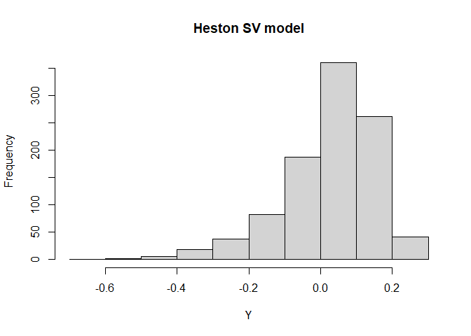

<!-- build with `devtools::build_readme()` -->
<!-- README.md is generated from README.Rmd. Please edit that file -->

# ajd.sim.wh

<!-- badges: start -->
<!-- badges: end -->

The goal of ajd.sim.wh is to **sim**ulate exactly the Heston Stochastic
Volatility (SV) model and its **A**ffine **J**ump **D**iffusion (AJD)
extensions using the **W**u-**H**u algorithm (Wu-Hu, 2024), hence the
name `ajd.sim.wh`. The extended models include

- SVJ: SV model with jumps in the price process.

- SVVJ: SV with jumps in the variance process.

- SVCJ: SV model with contemporaneous jumps both in the price and
  variance processes.

*References*:

- Kyriakou, I., Brignone, R., & Fusai, G. (2024). Unified moment-based
  modeling of integrated stochastic processes. *Operations Research*,
  72(4), 1630-1653.

## Installation

You can install the development version of ajd.sim.wh like so:

``` r
# library(devtools)
install_github("xmlongan/ajd.sim.wh")
```

## Example

This is a basic example which shows you how to simulate some return (not
the price) samples of the Heston SV model and plot a histogram of these
simulated returns:

``` r
library(ajd.sim.wh)
# Heston SV
v0 = 0.010201; k = 6.21; theta = 0.019; sigma = 0.61; rho = -0.7
r = 0.0319; tau = 1

par_hest = list(v0=v0, k=k, theta=theta, sigma=sigma, rho=rho, h=tau)
moms = rep(0, 8)
for (i in 2:8) {moms[i] = eval_mom_hest(ajd.sim.wh::fmu.hest[[i]], par_hest)}

N = 1000 # number of samples
Y = ajd.sim.wh::rpearson(1000, moms)

beta = (1  -exp(-k * tau)) / (2 * k)
Ymean = (r - theta/2) * tau - beta * (v0 - theta)

Y = Y + Ymean
hist(Y, main="Heston SV model")
```



If you want to simulate samples from the other two SV models, use:

- `price_svj()` for the SVJ model,

- `price_svcj()` for the SVCJ model.

## Pricing the European call option Using Monte Carlo simulation

If your are interested in pricing the European call option using Monte
Carlo simulation for the Heston SV, SVJ and SVCJ models. Please refer to
functions `?price_hest`, `?price_svj` and `?price_svcj`.
